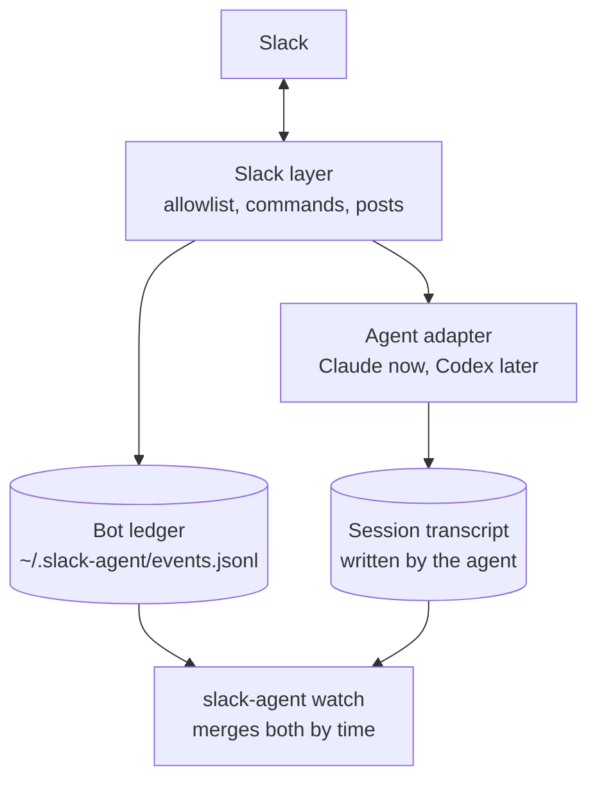

# slack-agent

Mention a bot in Slack and get an answer from your own Claude Code agent, running on your Mac, in
your repo, with your memory.

> **@bot** what kinds of agent docs and skills does this repo have? Show me a table
>
> **bot** Six kinds, about 57k lines. The pruning target is the bottom row, not the top. *(a native Slack table follows)*

## Why

Everything your Claude Code agent knows (your memory, your repo, your tools) lives on your laptop,
but the questions come up in Slack. slack-agent puts that same agent in Slack, running on your Mac in
one ongoing session, unlike Claude in Slack, which starts a fresh cloud sandbox from your GitHub repo
for every thread.

## Install

You need a Mac, Node 24+ and pnpm, Claude Code signed in (`claude login`), and permission to add an
app to your Slack workspace. Turns run on your Claude login and count toward its usage limits.

1. **Get the code.**
   ```bash
   git clone https://github.com/Monte9/slack-agent && cd slack-agent && pnpm install
   ```
2. **Create the Slack app.** At [api.slack.com/apps](https://api.slack.com/apps), choose *Create New
   App → From a manifest*, paste [`manifest.json`](manifest.json), and install it to your workspace.
3. **Add the tokens.** Copy `.env.example` to `.env` and fill in `SLACK_BOT_TOKEN` (*OAuth &
   Permissions*) and `SLACK_APP_TOKEN` (*Basic Information → App-Level Tokens*, scope `connections:write`).
4. **Configure.** Copy `config.example.json` to `config.json` and set `project` to your repo's path,
   `owner` to your Slack user id and `allowlist` to who may use it. Then put the safe default policy
   in place; without one, every tool is allowed:
   ```bash
   mkdir -p ~/.slack-agent && cp policy.example.json ~/.slack-agent/policy.json
   ```
5. **Run it in the background.**
   ```bash
   pnpm link --global && slack-agent install
   ```
   It starts now and at every login, and restarts if it dies. Invite the bot to a channel and mention it.

## Use it

| Where | What |
|---|---|
| Slack | Mention it with a question or a task. `@bot status` shows its session, and `@bot new` starts a fresh one (owner only). |
| Terminal | `slack-agent watch` shows what it is doing as it happens. `status`, `restart` and `logs` manage the service, and `ask "…"` runs one turn without Slack. |

## How it works



- **It runs where your memory lives.** The bot holds a Socket Mode connection from your Mac, so there
  is no public URL, and keeps the Mac awake on AC power, since a sleeping Mac drops the connection.
- **One session for everything.** Mentions queue, run in order and join the same agent session, which
  survives restarts. It reads the thread before answering, so "this" and "both" make sense.
- **A curated view of memory.** Sessions start in a generated workspace that links in only the memory
  files you share, then do their work in your repo.
- **Slack-sized.** Short replies, native tables, links to what it checked, and a post to the channel
  only when asked. A reply that runs long, skips a link or uses an em-dash goes back once for a fix.
- **Each fact has one owner.** The agent's transcript records what it did, and the bot's ledger records
  what happened around it, so `slack-agent watch` can merge the two without either repeating the other.

| File | Holds |
|---|---|
| Session transcript, written by the agent (`~/.claude/projects/<workspace>/<session>.jsonl`) | Everything the agent saw and did: the prompt and thread, its thinking, every tool call and result, its replies |
| `~/.slack-agent/events.jsonl`, the bot's ledger (owner-only) | Mentions, denials, commands, turns with time and cost, what was posted, connection drops, restarts, problems, policy decisions |
| `~/.slack-agent/bot.log` | The raw console: Slack SDK warnings and crash traces |

<details>
<summary>Configuration reference</summary>

- **`config.json`**: `project`, `owner`, `allowlist`, `memoryShare` (globs over memory file names,
  default `project_*` and `reference_*`), `maxReplyWords` (default 80; tables and code don't count),
  `model`, `stateDir`, `instructionsFile`, `policyFile`.
- **`~/.slack-agent/policy.json`**: rules, first match wins.
  ```json
  { "match": "mcp__claude_ai_Gmail__*", "allow": "nobody", "reason": "personal mail stays out of Slack" }
  { "match": "Bash(gh pr merge*)",      "allow": "owner",  "reason": "merging is the owner's call" }
  ```
  `match` is a tool name with `*` wildcards, or `Tool(argument*)` for a command prefix or file path.
  `allow` is `nobody`, `owner` or `everyone`, and unmatched tools are allowed. Rules are enforced in a
  hook before every tool call, re-read every turn, and shown to the agent so it explains a refusal.
  [`policy.example.json`](policy.example.json) keeps personal connectors (Gmail, Calendar, Drive,
  Slack-as-you) out and reserves push, merge, release and Notion writes for the owner.
- **`~/.slack-agent/instructions.md`** (optional): your house style, appended to the agent's prompt
  and re-read every turn.
- **`manifest.local.json`** (optional): your bot's own name and description, merged over
  `manifest.json`. The [Slack CLI](https://docs.slack.dev/tools/slack-cli) can install from it with
  `slack app install --environment deployed`.

</details>

<details>
<summary>Running and changing the bot</summary>

- `slack-agent install` writes a launchd agent and an app bundle in `~/Applications`, so Login Items
  shows your bot's name. It records the `node` and `pnpm` on your PATH, so run it again after
  upgrading Node.
- Only one copy runs at a time: a second exits and names the first.
- To change the code, `slack-agent stop`, then `slack-agent dev` (hot reload, and the session resumes
  from disk), then `slack-agent start`.
- `slack-agent scope` rebuilds the workspace and lists the memory it shares.

</details>

## Security

- Your tokens and `config.json` are gitignored.
- Only allowlisted users get answers, and the sender comes from the Slack event, never from the text.
- Memory is write-protected, and a session loads only the files `memoryShare` matches. That decides
  what it loads, not what it can read: the agent can open any file your user can, so keep the
  allowlist to people you trust.
- Every tool call passes the policy, and denials and owner-only uses are recorded in the ledger.
- Messages from other bots are ignored.
- Don't open the bot's session in a terminal while it runs; stop it first, then `claude --resume <id>`.

## Adapters

The agent runtime is an adapter, [`AgentAdapter`](src/agent/types.ts): it runs a prompt, resumes a
session, streams events, checks the policy before each tool, and says where its transcripts live and
how to read them. The Claude Agent SDK is the first; a Codex adapter can slot in beside it.

## License

MIT
