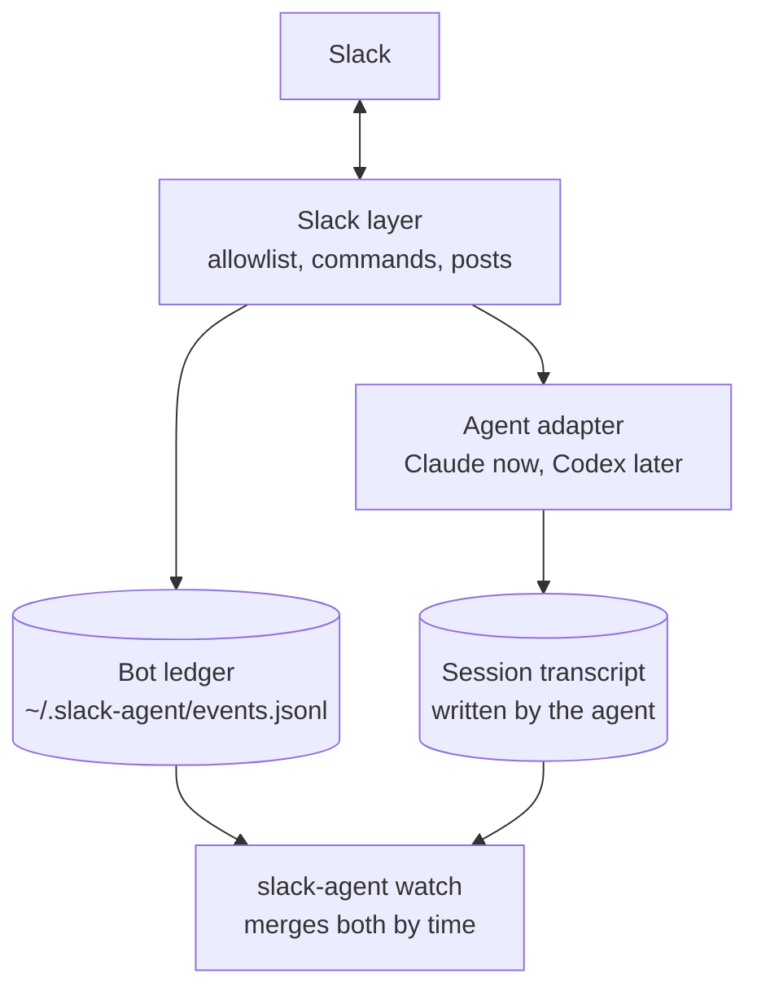

# slack-agent

Your Claude Code agent in Slack, running on your Mac, in your repo, with your memory.

## Why

Everything your Claude Code agent knows (your memory, your repo, your tools) lives on your laptop,
but the questions come up in Slack. slack-agent puts that same agent in Slack, running on your Mac in
one ongoing session, unlike Claude in Slack, which starts a fresh cloud sandbox from your GitHub repo
for every thread.

## Install

You need a Mac, Node 24+, pnpm, Claude Code signed in, and permission to add a Slack app. The bot's
turns count toward your Claude plan's limits.

1. Get the code:
   ```bash
   git clone https://github.com/Monte9/slack-agent && cd slack-agent && pnpm install
   ```
2. Create a Slack app from [`manifest.json`](manifest.json) (*api.slack.com/apps → Create New App →
   From a manifest*) and install it to your workspace.
3. Copy `.env.example` to `.env` and add the bot and app tokens; the file says where each one is.
4. Copy `config.example.json` to `config.json` and set `project` (your repo), `owner` (your Slack user
   id) and `allowlist`. Then copy the default policy, since without one every tool is allowed:
   ```bash
   mkdir -p ~/.slack-agent && cp policy.example.json ~/.slack-agent/policy.json
   ```
5. Run it in the background, now and at every login:
   ```bash
   pnpm link --global && slack-agent install
   ```
   Invite the bot to a channel and mention it.

## Use it

- **In Slack:** mention it with a question or a task. `@bot status` shows its session, and `@bot new`
  starts a fresh one.
- **In a terminal:** `slack-agent watch` shows what it is doing as it happens, and `status`, `restart`
  and `logs` manage it.

## How it works



- **On your Mac, not a server.** Socket Mode means there is no public URL, and the Mac stays awake on
  AC power so the connection holds.
- **One ongoing session.** Every mention joins it in order, it survives restarts, and it reads the
  thread before answering. For more, `slack-agent read` searches and reads the channels it is in.
- **Only the memory you share.** Sessions start in a workspace that links in the memory files matching
  `memoryShare`, then do their work in your repo.
- **Your rules.** A policy file decides which tools it can use and who can trigger them, and replies
  are kept Slack-sized and checked before they post.
- **A record of what it did.** The agent's transcript holds what it saw and did, and the bot's ledger
  holds mentions, posts, turns and policy decisions. `watch` shows both.
- **Any agent runtime.** The Claude Agent SDK runs it today, and another runtime, such as Codex, can
  plug in as an [adapter](src/agent/types.ts).

## Security

- Only allowlisted users get answers, and the sender comes from Slack, never from the message text.
- It posts in another channel only when the sender links that channel in the message that asks.
- It runs with your credentials and can read any file you can, so keep the allowlist to people you trust.
- Memory is read-only, and the policy is checked before every tool call.
- Tokens and `config.json` are gitignored.

## License

MIT
